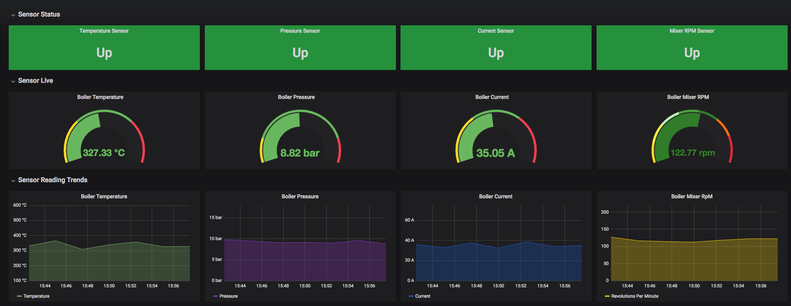
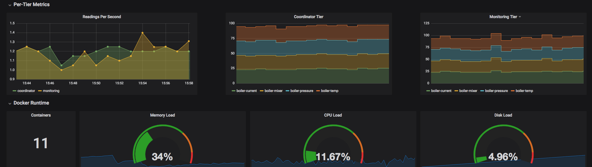

# Monitoring A Distributed Go Application
This project serves as a demonstration of how the concepts of distributed architecture can be applied to a Go application. 
The application its self simulates the sensors monitoring an industrial grade boiler in an ore purifying facility; and we do this by leveraging as many core Go concepts (concurrency: channels, goroutines etc) as possible.
The application is then packaged into docker containers; which have become the de facto industry standard for building micro-service based distributed systems. This allows for decoupling such that individual tiers of the architecture can be independently scaled out to match demand at a given time.

 

## Tech Stack
* [RabbitMq](https://www.rabbitmq.com/): [Erlang](https://www.erlang.org/) powered message broker.
* [Prometheus](https://prometheus.io/): Metric server and time series database (graphite) that provides a powerful monitoring solution.
* [Grafana](https://grafana.com/): Data analytics, visualisation and monitoring/alerting.

## Running the application
The most straight forward way of running the application locally is to use the *builder.sh* bash script:  
`. ./builder.sh`   
This will:  
1. Install Go dependencies.
2. Build the individual services in the Go application.
3. Package the application into docker images.
4. Launch the stack; accessed on port `3000`

---
**_NOTE:_**  
The application also monitors docker runtime metrics which are not enabled by default for desktop environments.  To do so:  
Click the Docker icon in the toolbar, select **Preferences**, then select **Daemon**. Click **Advanced**.
If the file is currently empty, paste the following:

```
{
  "metrics-addr" : "0.0.0.0:50501",
  "experimental" : true
}
```
---

## Credits
[Mike Van Sickle](https://app.pluralsight.com/library/courses/go-build-distributed-applications/description)  
[Elton Stoneman](https://app.pluralsight.com/library/courses/monitoring-containerized-app-health-docker)